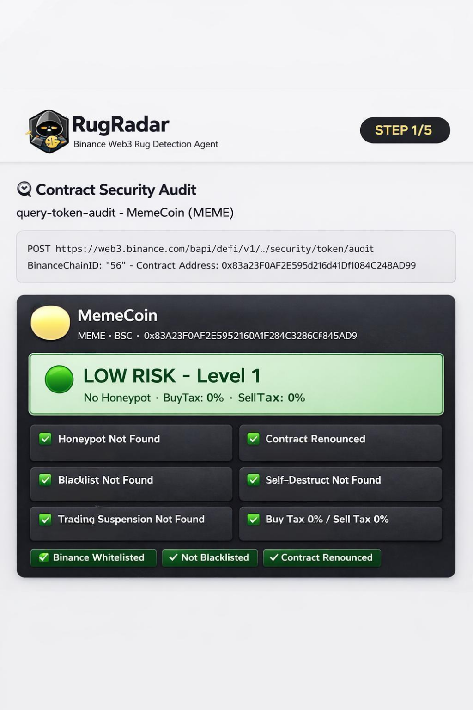
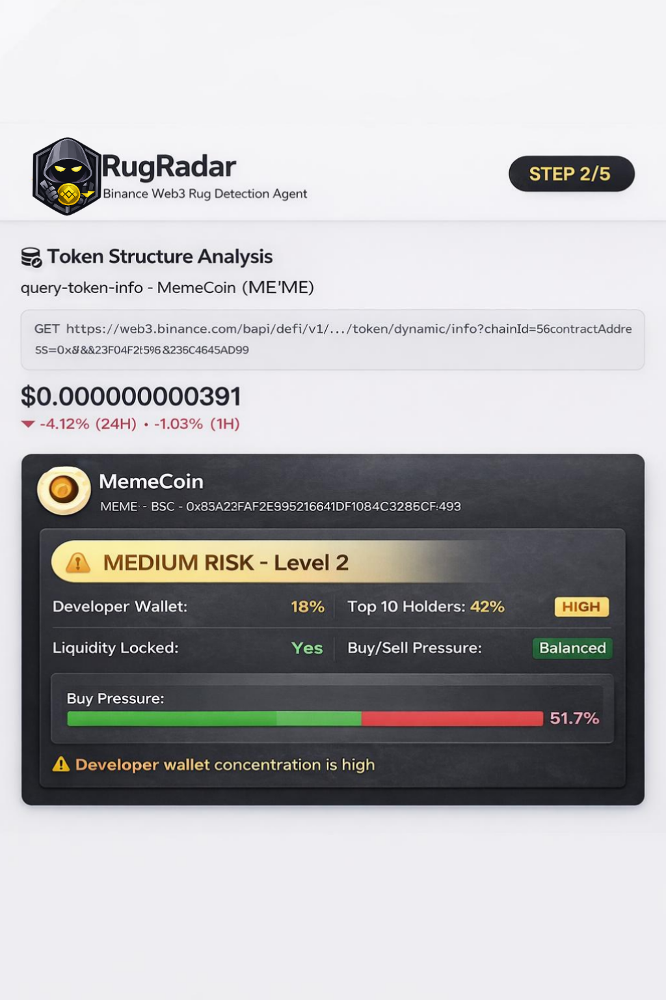
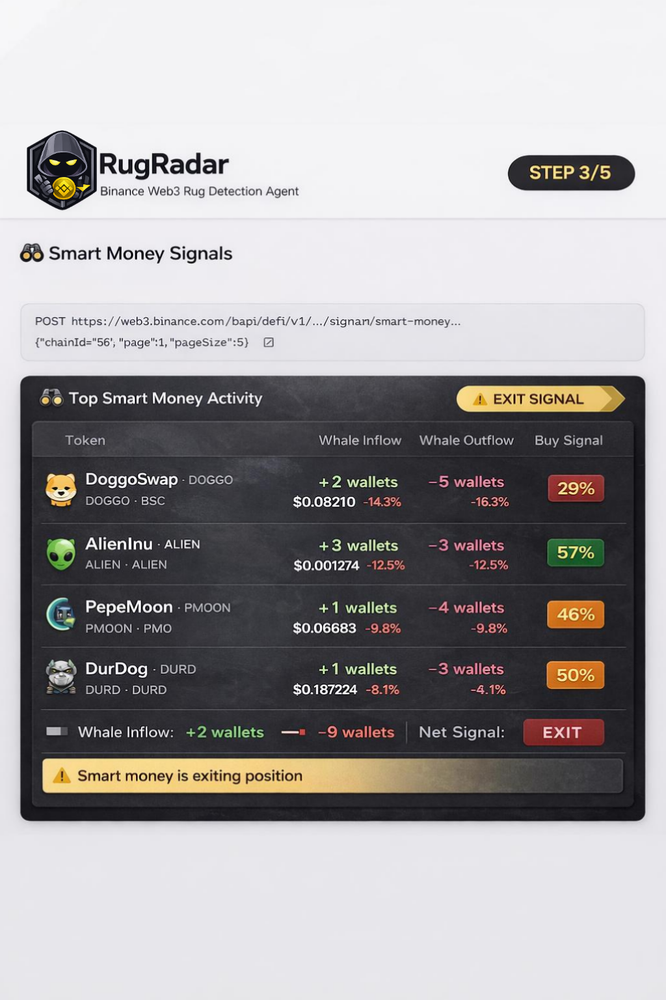
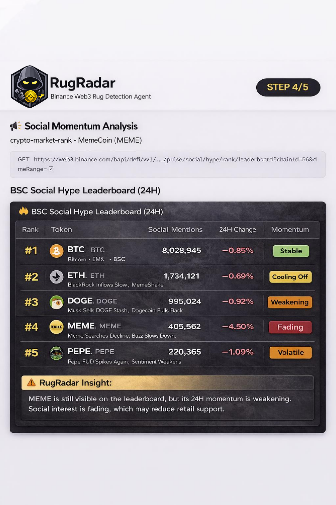
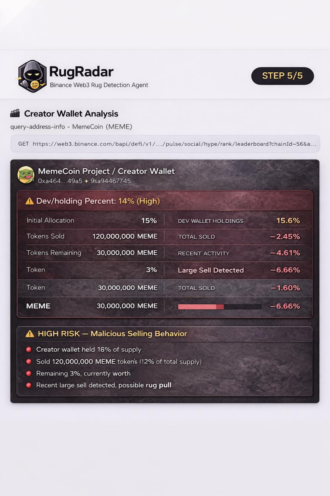

# RugRadar — Binance Web3 Rug Detection Agent

> Detect insider dumping before retail becomes exit liquidity.

RugRadar is an AI-powered on-chain intelligence system built on Binance Web3 data that detects whether a token’s project team may be quietly distributing or exiting while retail investors are still buying.

It answers one critical question:

> **“Did the team already sell before I bought in?”**

RugRadar runs a 5-step automated analysis pipeline — from contract security to creator wallet forensics — and outputs a unified risk rating with evidence.

---

## ✨ Core Skills

| Step | Skill | What it detects |
|------|-------|-----------------|
| 1️⃣ | `query-token-audit` | Honeypots, hidden taxes, blacklist/freeze functions, malicious contract logic |
| 2️⃣ | `query-token-info` | Buy/sell pressure, dev wallet %, holder concentration, liquidity structure |
| 3️⃣ | `trading-signal` | Whether smart money has entered, exited, or abandoned the token |
| 4️⃣ | `crypto-market-rank` | Social hype trend — is the narrative growing or fading? |
| 5️⃣ | `query-address-info` | Creator wallet forensics — has the team already cashed out? |

---

## 🧠 How RugRadar Works

RugRadar analyzes a token through 5 investigation layers and then combines all signals into one final score.

---

### STEP 1 — Contract Security Audit

RugRadar first checks whether the token contract itself is dangerous.

It looks for:
- honeypots
- hidden buy/sell taxes
- blacklist or freeze functions
- suspicious ownership permissions
- malicious contract behavior

**Code module**
```bash
api/query-token-audit.js
```

**Example request**
```http
POST https://web3.binance.com/bapi/defi/v1/public/wallet-direct/security/token/audit
{
  "binanceChainId": "56",
  "contractAddress": "<token_address>",
  "requestId": "<uuid>"
}
```

**Demo screenshot**



---

### STEP 2 — Token Structure Analysis

RugRadar then evaluates how the token is distributed and whether the structure already looks unhealthy.

It checks:
- buy vs sell pressure
- developer wallet percentage
- top holder concentration
- liquidity state
- smart money holding percentage

**Code module**
```bash
api/query-token-info.js
```

**Example request**
```http
GET https://web3.binance.com/bapi/defi/v1/.../token/dynamic/info?chainId=56&contractAddress=<token_address>
```

**Demo screenshot**



---

### STEP 3 — Smart Money Signals

This step checks whether stronger wallets are entering or leaving.

It looks for:
- whale inflow
- whale outflow
- smart money exit patterns
- abnormal market behavior

**Code module**
```bash
api/trading-signal.js
```

**Example request**
```http
POST https://web3.binance.com/bapi/defi/v1/public/.../signal/smart-money
{
  "chainId": "56",
  "page": 1,
  "pageSize": 100
}
```

**Demo screenshot**



---

### STEP 4 — Social Hype Ranking

Even if a token is technically safe, fading retail attention can still increase risk.

This step checks:
- social mentions
- 24H change
- narrative momentum
- whether the token is cooling off or fading

**Code module**
```bash
api/crypto-market-rank.js
```

**Example request**
```http
GET https://web3.binance.com/bapi/defi/v1/public/.../pulse/social/hype/rank/leaderboard?chainId=56&timeRange=1
```

**Demo screenshot**



---

### STEP 5 — Creator Wallet Forensics

This is the key evidence layer.

RugRadar investigates the creator or developer wallet directly to see whether the team is still aligned with the project.

It checks:
- creator holdings
- recent token sales
- transfers to exchanges
- whether the token still appears in active positions
- signs of insider distribution

**Code module**
```bash
api/query-address-info.js
```

**Example request**
```http
GET https://web3.binance.com/bapi/defi/v3/public/.../address/pnl/active-position-list?address=<creator_address>&chainId=56
```

**Demo screenshot**



---

## 📊 Final RugRadar Risk Report

After all five steps are completed, RugRadar combines the results into one final report.

**Scoring model**
- **0–29** → Low Risk
- **30–59** → Medium Risk
- **60–100** → Medium-High / High Risk

**Final demo screenshot**


---

## Demo Result Summary

### Analysis Target
**Meme Coin (MEME) · BSC**

| Dimension | Signal | Interpretation |
|-----------|--------|----------------|
| Contract Security | Low Risk | Contract appears technically safe |
| Market Data | Sell Signal | Sell pressure stronger than buy pressure |
| Smart Money | Inactive / Exit | Strong wallets are no longer participating |
| Social Momentum | Cooling | Community attention is weakening |
| Creator Wallet | Position Closed | Creator wallet shows clear exit behavior |

### Final Rating
**MEDIUM–HIGH RISK**

The contract itself may appear safe, but creator-wallet behavior, weak smart-money participation, and fading social momentum together indicate elevated rug risk.

---

## ⚙️ Tech Stack

- **AI Agent Framework:** OpenClaw-style modular agent system
- **Blockchain Data:** Binance Web3 API
- **Runtime:** JavaScript / Node.js
- **Output:** Unified risk report with evidence
- **Chain Focus:** BSC

---

## 📁 Project Structure

```text
RugRadar-AI-For-Binance
│
├── api
│   ├── query-token-audit.js
│   ├── query-token-info.js
│   ├── trading-signal.js
│   ├── crypto-market-rank.js
│   ├── query-address-info.js
│   └── rugradar-engine.js
│
├── docs
│   ├── pipeline.md
│   ├── architecture.md
│   └── skills.md
│
├── demo
│   └── example-report.json
│
├── screenshots
│   ├── step1-contract-security.png
│   ├── step2-token-structure-analysis.png
│   ├── step3-smart-money-signals.png
│   ├── step4-social-hype-ranking.png
│   ├── step5-creator-wallet-analysis.png
│   └── final-risk-report.png
│
├── agent-config.json
├── README.md
└── LICENSE
```

---

## 🚀 Usage

Example analysis request:

```json
{
  "tokenAddress": "0xTokenAddress",
  "creatorWallet": "0xCreatorWallet",
  "tokenSymbol": "MEME"
}
```

RugRadar then runs:

1. Contract audit  
2. Token structure analysis  
3. Smart money signal detection  
4. Social hype ranking  
5. Creator wallet forensics  

And returns a final risk score with supporting evidence.

---

## Disclaimer

RugRadar is an analytical tool designed to help traders detect suspicious patterns.  
It does **not** provide financial advice. Always DYOR.
